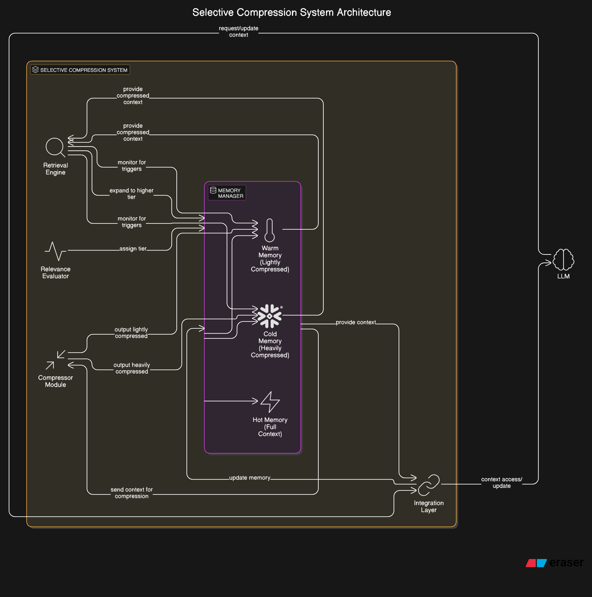
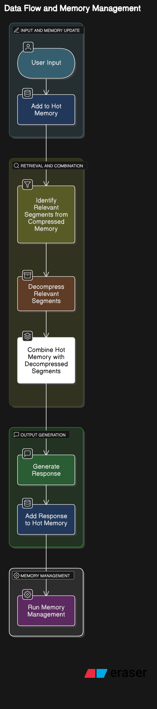

# Selective Compression: A Tiered Memory Architecture for LLMs

### Technical Framework Documentation

#### 1. Introduction

Selective Compression is a novel approach to managing context in Large Language Models (LLMs) through a multi-tiered memory architecture that dynamically compresses and stores information based on relevance, recency, and potential future utility. This document outlines the technical framework for implementing a Selective Compression system for LLMs.

The core innovation lies in treating the context window as a tiered memory system rather than a fixed-size container, allowing much larger effective context through strategic compression and decompression of information while maintaining semantic relevance.

#### 2. System Architecture

##### 2.1 High-Level Architecture

The Selective Compression system consists of five primary components:

a. Memory Manager: Orchestrates the flow of information between memory tiers  
b. Compressor Module: Performs semantic compression of context segments  
c. Relevance Evaluator: Determines importance and relevance of information  
d. Retrieval Engine: Identifies when compressed information needs expansion  
e. Integration Layer: Interfaces with the underlying LLM  



##### 2.2 Memory Tiers

The memory system is divided into three distinct tiers:

**Hot Memory:**  
- Contains full, uncompressed recent context  
- Directly accessible to the LLM  
- Fixed size based on immediate context needs (e.g., last 2,000 tokens)  
- Highest priority for retrieval and response generation  

**Warm Memory:**  
- Contains lightly compressed representations of moderately important context  
- Represented as semantic summaries with key details preserved  
- Variable size depending on content importance  
- Compression ratio: approximately 3:1 to 5:1  

**Cold Memory:**  
- Contains heavily summarized representations of background context  
- Stores essential entities, relationships, and critical facts only  
- Large capacity for long-term context preservation  
- Compression ratio: approximately 8:1 to 15:1  

#### 3. Technical Components in Detail

##### 3.1 Memory Manager

The Memory Manager orchestrates the entire system, handling the flow of information between memory tiers and making decisions about when to compress, decompress, or evict content.  
**Key Responsibilities:**  
- Maintaining the state of all memory tiers  
- Orchestrating compression/decompression operations  
- Enforcing memory constraints  
- Managing metadata for each memory segment  
- Interfacing with other system components  

**Memory Segment Structure:**
```python
class MemorySegment:
    """Representation of a segment in memory"""
    def __init__(self, 
                 content: str, 
                 importance_score: float,
                 creation_timestamp: float,
                 last_accessed_timestamp: float,
                 access_count: int,
                 segment_id: str,
                 compression_level: int,  # 0=none, 1=light, 2=heavy
                 metadata: dict):
        # Initialize attributes
        pass
```

**Memory Manager Algorithm (High-Level):**
```python
function MANAGE_MEMORY():
    while True:
        # Check if hot memory exceeds threshold
        if HOT_MEMORY.size > HOT_MEMORY_THRESHOLD:
            segments_to_compress = SELECT_SEGMENTS_FOR_COMPRESSION(HOT_MEMORY)
            for segment in segments_to_compress:
                compressed_segment = COMPRESSOR.compress(segment, level=1)
                MOVE_TO_WARM_MEMORY(compressed_segment)
        
        # Check if warm memory exceeds threshold
        if WARM_MEMORY.size > WARM_MEMORY_THRESHOLD:
            segments_to_compress_further = SELECT_SEGMENTS_FOR_COMPRESSION(WARM_MEMORY)
            for segment in segments_to_compress_further:
                heavily_compressed_segment = COMPRESSOR.compress(segment, level=2)
                MOVE_TO_COLD_MEMORY(heavily_compressed_segment)
                
        # Check if cold memory exceeds threshold
        if COLD_MEMORY.size > COLD_MEMORY_THRESHOLD:
            segments_to_evict = SELECT_SEGMENTS_FOR_EVICTION(COLD_MEMORY)
            for segment in segments_to_evict:
                EVICT_SEGMENT(segment)
                
        # Sleep to avoid constant checking
        SLEEP(CHECK_INTERVAL)
```

##### 3.2 Compressor Module

The Compressor Module is responsible for creating compressed representations of context segments at different compression levels.  
**Key Responsibilities:**  
- Implementing compression algorithms for different compression levels  
- Preserving critical semantic information during compression  
- Maintaining compression metadata for potential future expansion  
- Optimizing compression for different types of content  

**Compression Strategies:**  
- **Light Compression (Warm Memory):**  
  - Summarization while preserving key details  
  - Entity and relationship preservation  
  - Removal of redundant information  
  - Preservation of critical facts and opinions  

- **Heavy Compression (Cold Memory):**  
  - Extreme summarization focused on core concepts  
  - Entity and relationship extraction only  
  - Conversion to structured representation where possible  
  - Retention of only the most critical information  

**Compression Algorithm:**
```python
function COMPRESS(segment, level):
    # Extract segment content
    content = segment.content
    
    if level == 1:  # Light compression
        # 1. Split content into semantic chunks
        chunks = SPLIT_INTO_SEMANTIC_CHUNKS(content)
        
        # 2. For each chunk, create a summary preserving key details
        compressed_chunks = []
        for chunk in chunks:
            # Extract key entities and relations
            entities = EXTRACT_ENTITIES(chunk)
            relationships = EXTRACT_RELATIONSHIPS(chunk)
            
            # Create compressed representation preserving details
            compressed_chunk = SUMMARIZE_WITH_DETAILS(chunk, entities, relationships)
            compressed_chunks.append(compressed_chunk)
        
        # 3. Reassemble the compressed chunks
        compressed_content = JOIN_CHUNKS(compressed_chunks)
        
    elif level == 2:  # Heavy compression
        # 1. Extract core entities and relationships from entire segment
        entities = EXTRACT_ENTITIES(content)
        relationships = EXTRACT_RELATIONSHIPS(content)
        
        # 2. Create a highly concise representation focusing on main points
        compressed_content = CREATE_MINIMAL_REPRESENTATION(entities, relationships)
    
    # Create new segment with compressed content
    compressed_segment = CREATE_NEW_SEGMENT(
        content=compressed_content,
        importance_score=segment.importance_score,
        creation_timestamp=segment.creation_timestamp,
        last_accessed_timestamp=segment.last_accessed_timestamp,
        access_count=segment.access_count,
        segment_id=segment.segment_id,
        compression_level=level,
        metadata={
            'original_length': len(content),
            'compressed_length': len(compressed_content),
            'compression_ratio': len(content) / len(compressed_content),
            'original_entities': EXTRACT_ENTITIES(content),
            'retained_entities': EXTRACT_ENTITIES(compressed_content)
        }
    )
    
    return compressed_segment
```

##### 3.3 Relevance Evaluator

The Relevance Evaluator determines the importance of memory segments, influencing compression and eviction decisions.  
**Key Responsibilities:**  
- Calculating importance scores for memory segments  
- Predicting potential future relevance of information  
- Adjusting scores based on usage patterns  
- Identifying information that should be preserved regardless of age  

**Scoring Factors:**  
- Recency (time decay)  
- Access frequency  
- Semantic relevance to recent queries  
- Entity importance (based on entity frequency across context)  
- Information uniqueness  
- Explicit markers of importance from the LLM or user  

**Relevance Scoring Algorithm:**
```python
function CALCULATE_IMPORTANCE(segment, current_context, user_query=None):
    # Base score calculation
    recency_score = CALCULATE_RECENCY_SCORE(segment.creation_timestamp)
    access_score = CALCULATE_ACCESS_SCORE(segment.access_count, segment.last_accessed_timestamp)
    
    # Semantic relevance to current context
    semantic_relevance = CALCULATE_SEMANTIC_SIMILARITY(segment.content, current_context)
    
    # Entity-based importance
    entities = EXTRACT_ENTITIES(segment.content)
    entity_importance = CALCULATE_ENTITY_IMPORTANCE(entities, current_context)
    
    # Information uniqueness
    uniqueness_score = CALCULATE_INFORMATION_UNIQUENESS(segment.content, ALL_SEGMENTS)
    
    # If we have a current query, calculate relevance to it
    query_relevance = 0
    if user_query:
        query_relevance = CALCULATE_QUERY_RELEVANCE(segment.content, user_query)
    
    # Combine scores with appropriate weights
    importance_score = (
        W_RECENCY * recency_score +
        W_ACCESS * access_score +
        W_SEMANTIC * semantic_relevance +
        W_ENTITY * entity_importance +
        W_UNIQUENESS * uniqueness_score +
        W_QUERY * query_relevance
    )
    
    # Apply any explicit importance markers
    if HAS_EXPLICIT_IMPORTANCE_MARKER(segment):
        importance_score *= IMPORTANCE_MARKER_MULTIPLIER
    
    return importance_score
```

##### 3.4 Retrieval Engine

The Retrieval Engine identifies when compressed information becomes relevant and should be expanded for use by the LLM.  
**Key Responsibilities:**  
- Continuously evaluating relevance of compressed segments to current context  
- Triggering decompression of relevant segments  
- Prioritizing which segments to decompress when multiple are relevant  
- Managing the decompression process  

**Retrieval Process:**  
On each new user input or significant context change:  
- Calculate relevance of compressed segments to current context  
- Identify segments that exceed the relevance threshold  
- Prioritize segments for decompression based on relevance score  
- Trigger decompression of high-priority segments  

**Decompression implementation:**  
- For lightly compressed segments: Expand using direct LLM prompting  
- For heavily compressed segments: Perform structured expansion with LLM  

**Retrieval Algorithm:**
```python
function IDENTIFY_RELEVANT_SEGMENTS(current_context, user_query=None):
    relevant_segments = []
    
    # Check all segments in warm and cold memory
    for segment in WARM_MEMORY.segments + COLD_MEMORY.segments:
        # Calculate relevance to current context
        relevance_score = CALCULATE_RELEVANCE(segment, current_context, user_query)
        
        # If relevance exceeds threshold, mark for retrieval
        if relevance_score > RELEVANCE_THRESHOLD:
            relevant_segments.append((segment, relevance_score))
    
    # Sort by relevance score
    relevant_segments.sort(key=lambda x: x[1], reverse=True)
    
    # Return top N segments, respecting memory constraints
    return [segment for segment, _ in relevant_segments[:MAX_SEGMENTS_TO_RETRIEVE]]

function DECOMPRESS_SEGMENT(segment):
    if segment.compression_level == 1:  # Lightly compressed
        # Use the LLM to expand the summary back to detailed form
        prompt = GENERATE_EXPANSION_PROMPT(segment.content, segment.metadata)
        expanded_content = LLM.generate(prompt)
    
    elif segment.compression_level == 2:  # Heavily compressed
        # Use structured expansion for heavily compressed content
        prompt = GENERATE_STRUCTURED_EXPANSION_PROMPT(segment.content, segment.metadata)
        expanded_content = LLM.generate(prompt)
    
    # Create new segment with expanded content
    expanded_segment = CREATE_NEW_SEGMENT(
        content=expanded_content,
        importance_score=segment.importance_score,
        creation_timestamp=segment.creation_timestamp,
        last_accessed_timestamp=time.time(),  # Update access time
        access_count=segment.access_count + 1,  # Increment access count
        segment_id=segment.segment_id,
        compression_level=0,  # Fully expanded
        metadata={
            'was_compressed': True,
            'original_compression_level': segment.compression_level,
            'expansion_timestamp': time.time()
        }
    )
    
    return expanded_segment
```

##### 3.5 Integration Layer

The Integration Layer connects the Selective Compression system to the underlying LLM, handling the interface between the memory system and the model.  
**Key Responsibilities:**  
- Preparing context by combining hot memory with decompressed content  
- Handling LLM API calls  
- Processing LLM outputs and updating memory accordingly  
- Managing the conversation flow  

**Integration Flow:**
```
┌───────────────┐     ┌───────────────┐     ┌───────────────┐
│   User        │     │ Integration   │     │    Memory     │
│   Input       │────▶│    Layer      │◀───▶│    Manager    │
└───────────────┘     └───────────────┘     └───────────────┘
                             │                      ▲
                             │                      │
                             ▼                      │
                      ┌───────────────┐     ┌───────────────┐
                      │      LLM      │     │   Retrieval   │
                      │               │     │    Engine     │
                      └───────────────┘     └───────────────┘
```

**Integration Algorithm:**
```python
function PROCESS_USER_INPUT(user_input):
    # 1. Update memory with user input
    MEMORY_MANAGER.add_to_hot_memory(user_input)
    
    # 2. Identify relevant compressed memories
    relevant_segments = RETRIEVAL_ENGINE.identify_relevant_segments(
        current_context=MEMORY_MANAGER.get_hot_memory(),
        user_query=user_input
    )
    
    # 3. Decompress relevant segments
    decompressed_segments = []
    for segment in relevant_segments:
        decompressed = RETRIEVAL_ENGINE.decompress_segment(segment)
        decompressed_segments.append(decompressed)
    
    # 4. Construct context for LLM
    context = CONSTRUCT_CONTEXT(
        hot_memory=MEMORY_MANAGER.get_hot_memory(),
        decompressed_segments=decompressed_segments
    )
    
    # 5. Generate response using the LLM
    llm_response = LLM.generate(context, user_input)
    
    # 6. Update memory with LLM response
    MEMORY_MANAGER.add_to_hot_memory(llm_response)
    
    # 7. Run memory maintenance
    MEMORY_MANAGER.manage_memory_tiers()
    
    return llm_response
```


#### 4. Implementation Details

##### 4.1 Segmentation Strategy

Effective segmentation is crucial for the Selective Compression system. Rather than arbitrary token-based divisions, we employ semantic segmentation.

**Segmentation Approaches:**
- Topic-Based Segmentation: Detect topic changes in the conversation
- Temporal Segmentation: Create boundaries based on time (e.g., conversation turns)
- Entity-Based Segmentation: Group content around key entities

**Segmentation Algorithm:**
```python
function SEGMENT_CONTENT(content):
    # 1. Perform initial splitting by conversation turns
    turn_segments = SPLIT_BY_TURNS(content)
    
    # 2. Further segment long turns by topic shifts
    final_segments = []
    for segment in turn_segments:
        if LEN(segment) > MAX_SEGMENT_LENGTH:
            # Detect topic shifts
            topic_segments = DETECT_TOPIC_SHIFTS(segment)
            final_segments.extend(topic_segments)
        else:
            final_segments.append(segment)
    
    # 3. Create MemorySegment objects for each segment
    memory_segments = []
    for segment in final_segments:
        memory_segment = CREATE_MEMORY_SEGMENT(segment)
        memory_segments.append(memory_segment)
    
    return memory_segments
```

##### 4.2 Compression Techniques

The compression module utilizes several techniques depending on the desired compression level.

**Light Compression Techniques:**
- Extractive Summarization: Identify and retain key sentences
- Entity and Relationship Preservation: Ensure all key entities and their relationships remain
- Redundancy Elimination: Remove repeated information while preserving nuance

**Heavy Compression Techniques:**
- Abstractive Summarization: Generate concise summaries capturing core meaning
- Structured Knowledge Extraction: Convert narrative text to structured facts
- Hierarchical Importance Filtering: Retain only highest-importance elements

**Implementation Approaches:**
For both compression levels, we can use:
- LLM-based compression: Use the same or a smaller LLM to perform compression
- Fine-tuned specialized compressors: Train dedicated models for compression tasks
- Hybrid approaches: Combine rule-based techniques with machine learning

##### 4.3 Relevance Evaluation Metrics

Detailed explanation of how relevance scores are calculated:

**Recency Score:**
```python
function CALCULATE_RECENCY_SCORE(creation_timestamp):
    age = CURRENT_TIME() - creation_timestamp
    return exp(-RECENCY_DECAY_FACTOR * age)
```

**Access Score:**
```python
function CALCULATE_ACCESS_SCORE(access_count, last_accessed_timestamp):
    recency_factor = exp(-ACCESS_RECENCY_DECAY_FACTOR * (CURRENT_TIME() - last_accessed_timestamp))
    frequency_factor = 1 - exp(-ACCESS_COUNT_FACTOR * access_count)
    return ALPHA * recency_factor + (1 - ALPHA) * frequency_factor
```

**Semantic Similarity:**
```python
function CALCULATE_SEMANTIC_SIMILARITY(segment_content, current_context):
    # Extract embeddings
    segment_embedding = EMBEDDING_MODEL.embed(segment_content)
    context_embedding = EMBEDDING_MODEL.embed(current_context)
    
    # Calculate cosine similarity
    return COSINE_SIMILARITY(segment_embedding, context_embedding)
```

**Entity Importance:**
```python
function CALCULATE_ENTITY_IMPORTANCE(entities, current_context):
    # Extract entities from current context
    context_entities = EXTRACT_ENTITIES(current_context)
    
    # Calculate overlap
    overlap_count = len(set(entities).intersection(set(context_entities)))
    
    # Weight by global entity importance
    weighted_importance = 0
    for entity in entities:
        if entity in context_entities:
            weighted_importance += GLOBAL_ENTITY_IMPORTANCE[entity]
    
    return BETA * (overlap_count / max(1, len(entities))) + (1 - BETA) * weighted_importance
```

##### 4.4 Decompression Strategies

Decompression aims to recreate detailed information from compressed representations.

**Light Decompression:**
Using prompts that instruct the LLM to expand the summary while maintaining factual consistency:
```python
function GENERATE_EXPANSION_PROMPT(compressed_content, metadata):
    prompt = f"""
    Below is a compressed summary of a conversation segment. 
    Please expand this summary into a detailed passage that preserves all the 
    information while adding natural language flow and detail.
    
    Important entities to include: {metadata['retained_entities']}
    
    Compressed content:
    {compressed_content}
    
    Expanded content:
    """
    return prompt
```

**Heavy Decompression:**
Using structured prompts with entity information to guide detailed expansion:
```python
function GENERATE_STRUCTURED_EXPANSION_PROMPT(compressed_content, metadata):
    prompt = f"""
    Below is a heavily compressed representation of conversation information.
    Please expand this into a natural, detailed passage that includes all the
    entities and relationships mentioned.
    
    The expansion should be coherent and read naturally while preserving all facts.
    
    Original entities: {metadata['original_entities']}
    
    Compressed representation:
    {compressed_content}
    
    Expanded content:
    """
    return prompt
```


### 5. Implementation Architecture in Python
#### 5.1 Class Structure

SelectiveCompressionSystem
├── MemoryManager
│   ├── HotMemory
│   ├── WarmMemory
│   └── ColdMemory
├── CompressorModule
│   ├── LightCompressor
│   └── HeavyCompressor
├── RelevanceEvaluator
│   ├── RecencyScorer
│   ├── AccessScorer
│   ├── SemanticScorer
│   └── EntityScorer
├── RetrievalEngine
│   ├── RelevanceDetector
│   └── DecompressionHandler
└── IntegrationLayer
    ├── ContextBuilder
    ├── LLMInterface
    └── ResponseProcessor

#### 5.2 Data Flow



