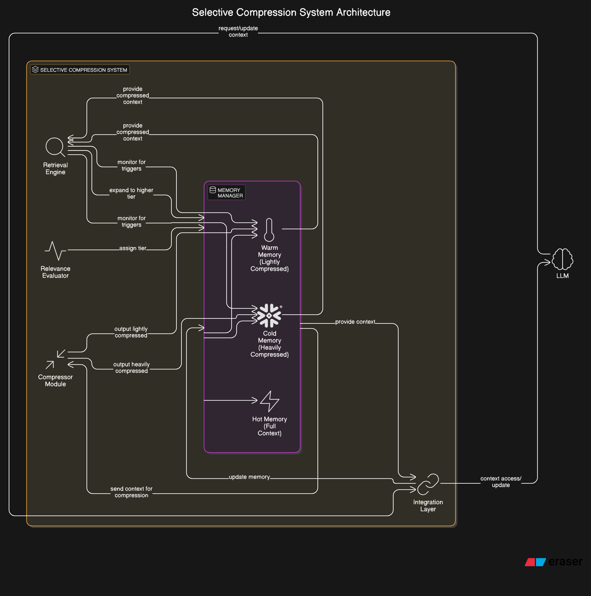

# Selective Compression: A Tiered Memory Architecture for LLMs

### Technical Framework Documentation

#### 1. Introduction

Selective Compression is a novel approach to managing context in Large Language Models (LLMs) through a multi-tiered memory architecture that dynamically compresses and stores information based on relevance, recency, and potential future utility. This document outlines the technical framework for implementing a Selective Compression system for LLMs.

The core innovation lies in treating the context window as a tiered memory system rather than a fixed-size container, allowing much larger effective context through strategic compression and decompression of information while maintaining semantic relevance.

#### 2. System Architecture

2.1 High-Level Architecture

The Selective Compression system consists of five primary components:

a. Memory Manager: Orchestrates the flow of information between memory tiers
b. Compressor Module: Performs semantic compression of context segments
c. Relevance Evaluator: Determines importance and relevance of information
d. Retrieval Engine: Identifies when compressed information needs expansion
e. Integration Layer: Interfaces with the underlying LLM

